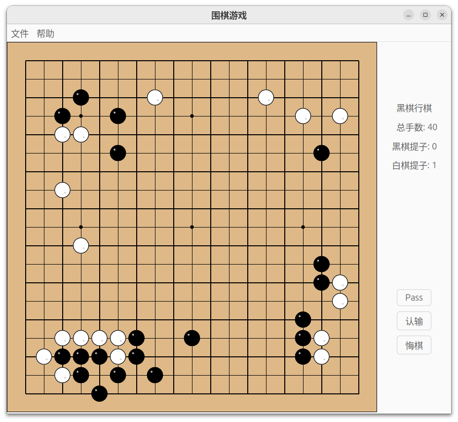

# 围棋游戏 (Go Game)

一个使用Racket语言开发的完整围棋游戏，支持中国围棋规则（数子法）。

99% 代码由 QWen 大模型生成。



## 项目结构

```
go-rkt/
├── src/              # 核心源代码
│   ├── board.rkt         # 棋盘数据结构和操作
│   ├── stone.rkt         # 棋子类型定义
│   ├── rules.rkt         # 围棋规则引擎（核心算法）
│   ├── game-engine.rkt   # 游戏主引擎
│   ├── game-state.rkt    # 游戏状态管理
│   ├── custom-format.rkt # 自定义棋谱格式处理
│   ├── sgf-format.rkt    # SGF标准格式处理
│   ├── ko-rule.rkt       # 劫争规则实现
│   ├── scoring.rkt       # 计分系统
│   ├── gui-main.rkt      # 图形用户界面
│   └── main.rkt          # 程序入口点
├── tests/            # 测试文件
│   └── *test*.rkt        # 各种功能测试
├── analysis/         # 分析和调试工具
│   └── *analysis*.rkt    # 问题分析和算法调试工具
├── data/             # 游戏数据文件
│   └── game-01.txt       # 示例棋谱文件
├── docs/             # 文档目录
└── README.md         # 项目说明文档
```

## 功能特性

### 🎯 核心游戏功能
- ✅ **完整围棋规则**：支持中国规则（数子法）
- ✅ **合法性检查**：自动检测禁入点、自杀、打劫等非法移动
- ✅ **实时计分**：动态显示双方提子数量
- ✅ **游戏结束判定**：自动检测双Pass结束和计算胜负

### 📝 棋谱功能
- ✅ **SGF格式支持**：标准围棋棋谱格式的保存和加载
- ✅ **自定义格式**：人类可读的文本格式保存
- ✅ **历史记录**：完整的对局过程记录

### 🔁 复盘功能
- ✅ **悔棋操作**：支持撤销上一步
- ✅ **复盘模式**：游戏模式与复盘模式可自由切换
- ✅ **播放器式控制**：支持首手/末手、前后1手、前后5手跳转
- ✅ **只读回看**：复盘模式下禁止落子、Pass、认输、悔棋，避免改动原棋局

### 🖥️ 图形界面
- ✅ **直观棋盘**：19×19标准棋盘显示
- ✅ **鼠标操作**：点击落子，直观易用
- ✅ **状态显示**：实时显示当前玩家、分数等信息
- ✅ **菜单系统**：完整的文件操作和游戏控制

## 项目架构

### 分层设计
```
用户界面层 (GUI)
    ↓
游戏逻辑层 (Game Engine)
    ↓
规则引擎层 (Rules/Ko/Scoring)
    ↓
数据模型层 (Board/Stone/Game State)
```

### 模块结构

#### 数据模型层
- `board.rkt` - 棋盘数据结构和基本操作
- `stone.rkt` - 棋子数据结构和颜色管理  
- `game-state.rkt` - 游戏状态和历史记录管理

#### 规则引擎层
- `rules.rkt` - 围棋核心规则（合法性检查、连通性分析）
- `ko-rule.rkt` - 劫争规则处理
- `scoring.rkt` - 中国规则数子法计分

#### 游戏逻辑层
- `game-engine.rkt` - 游戏主控制器，整合所有规则

#### 持久化层
- `sgf-format.rkt` - SGF标准格式支持
- `custom-format.rkt` - 自定义文本格式

#### 用户界面层
- `gui-main.rkt` - 完整的图形用户界面

## 使用方法

### 启动游戏
```bash
racket main.rkt
```

### 基本操作
1. **落子**：在棋盘上点击想要的位置
2. **Pass**：点击控制面板的"Pass"按钮
3. **认输**：点击控制面板的"认输"按钮
4. **悔棋**：点击控制面板的"悔棋"按钮
5. **复盘模式**：点击"复盘"进入复盘模式，按钮文案会变为"结束"，再次点击可退出复盘模式

### 复盘控制
- `|<`：跳到第一手
- `<`：后退1手
- `<<`：后退5手
- `>`：前进1手
- `>>`：前进5手
- `>|`：跳到最后一手

### 文件操作
- **新游戏**：文件菜单 → 新游戏
- **保存棋谱**：文件菜单 → 保存SGF/保存自定义格式
- **加载棋谱**：文件菜单 → 打开SGF/打开自定义格式

## 技术特点

### 函数式编程风格
- 不可变数据结构
- 状态通过返回新实例而非修改原实例
- 纯函数设计，易于测试和调试

### 模块化设计
- 高内聚低耦合
- 清晰的接口定义
- 易于扩展和维护

### 完整测试覆盖
- 每个模块都有独立的单元测试
- 使用Racket的rackunit测试框架
- 确保代码质量和稳定性

## 开发环境

- **语言**：Racket 8.0+
- **GUI库**：racket/gui
- **测试框架**：rackunit

## 已知问题

- 棋盘格线条粗细不一
- 在有棋子的地方点击时，会提示非法移动

## 扩展可能性

### 规则扩展
- 支持日本规则/应氏规则
- 添加让子棋功能
- 实现时限制功能

### 界面改进
- 添加音效支持
- 实现动画效果
- 支持皮肤主题

### 网络功能
- 在线对弈支持
- 棋谱分享平台
- AI对手集成

## 许可证

MIT License

## 作者

使用Racket语言开发的围棋游戏项目

起步于：QWEN 围棋游戏编程 https://chatgpt.com/share/698b0279-2688-800e-8169-78737f683d02
